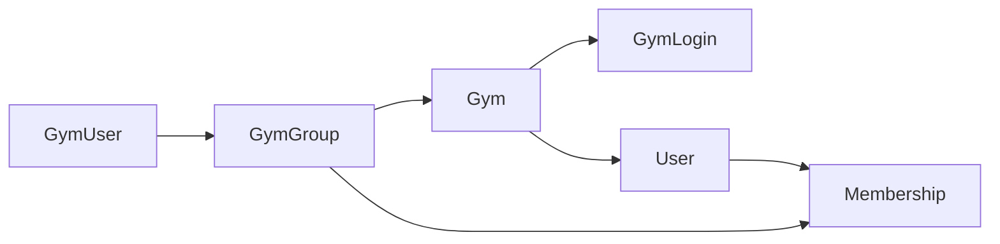

# BetaBase
A new climbing gym member management system

Created by Caitlin McLaughlin

## MVP
- [x] Sidebar control
- [ ] Staff Clock In / Out
  - [ ] Prompt for verification: Pin?
- [ ] Member Check In / Out
  - [x] Member info display
  - [x] Search bar
  - [ ] Check in log
- [x] User Information Pop Up
  - [x] First, preferred, and last name
  - [x] Date of birth
  - [x] Phone number
  - [ ] Photo
  - [x] Member ID
  - [x] Member since (optional)
  - [x] Account type
  - [ ] Billing info
    - [ ] Setup Stripe
  - [x] Address
  - [x] Emergency contact info
- [ ] POS (prompt company to configure options)
  - [ ] Membership
    - [x] Day Pass (variations)
    - [x] Monthly
    - [x] Punch Card
    - [x] Rentals (shoes, chalk)
  - [ ] Merch (Examples)
    - [ ] Shirts
    - [ ] Sweatshirts
    - [ ] Various Gear
    - [ ] Drinks
  - [ ] Add items (Admin only)
  - [x] Search section
  - [x] Checkout section
- [ ] Calender
  - [x] General display
  - [ ] Add events (Admin only)
- [ ] Analytics (Admin only?)
  - [x] General display
  - [ ] Member breakdown (punch cards / day passes / birthdays / staff / monthly membership)
  - [ ] Sales
- [ ] Settings
  - [x] Toggle Defualt Info
  - [ ] Add Custom Info

## Model Relationships

```
GymUser       Many --> 1    GymGroup

GymGroup      1 --> Many    GymUsers
              1 --> Many    Gym

Gym           Many --> 1    GymGroup
              1 --> Many    GymLogins
              1 --> Many    Memberships
            
GymLogin      Many --> 1    Gyms

User          1 --> Many    Memberships

Membership    Many --> 1    Gym
              Many --> 1    User
```
## Directory Structure
BetaBase
- gradle
- backend
  - src
    - main
      - java/com/example/betabase
        - config
          - [x] AppConfig.java
          - [x] DotenvInitializer.java
          - [x] JacksonConfig.java
          - [x] SecurityConfig.java
        - controllers
          - [x] AuthController.java
          - [ ] CheckInLogController.java
          - [x] GymController.java
          - [x] MembershipController.java
          - [x] UserController.java
        - dtos
          - [x] ErrorResponse.java
          - [x] GymDto.java
          - [x] GymRegistrationRequest.java
          - [x] JwtResponse.java
          - [x] LoginRequest.java
          - [x] MembershipCreateDto.java
          - [x] MembershipDto.java
          - [x] UserCreateDto.java
          - [x] UserDto.java
        - enums
          - [x] GenderType.java
          - [x] PronounsType.java
          - [x] UserType.java
        - exceptions
          - [x] GlobalExceptionHandler.java
        - models
          - [x] Address.java
          - [ ] CheckInLogEntry.java
          - [ ] DailyCheckInLog.java
          - [x] Gym.java
          - [x] GymGroup.java
          - [x] GymLogin.java
          - [x] Membership.java
          - [x] User.java
        - repositories
          - [ ] CheckInLogEntry.java
          - [ ] DailyCheckInLog.java
          - [x] GymLoginRepository.java
          - [x] GymRepository.java
          - [x] MembershipRepository.java
          - [x] UserRepository.java
        - security
          - [x] JwtAuthFilter.java
          - [x] JwtService.java
        - services
          - [ ] CheckInLogService.java
          - [x] CurrentUserService.java
          - [x] GymLoginService.java
          - [x] GymService.java
          - [x] MembershipService.java
          - [x] UserService.java
        - tools
          - [x] GenerateSecretKey.java
        - BetaBaseApplication.java
      -  resources
        -  (other directories)
        -  application.yml
    -  test
      -  (same directory structure as main + tests)
  - .env 
- build 
- frontend 
  - src
    - main
      - java/com/betabase
        - controllers
          - [ ] AnalyticsController.java
          - [ ] CallendarController.java
          - [ ] CheckInController.java
            - NEEDS UPDATING
          - [x] CreateAccountController.java
          - [ ] DashboardController.java
            - NEEDS UPDATING
          - [x] GymLoginController.java
          - [x] PosController.java
          - [ ] SettingsController.java
          - [x] SidebarController.java
          - [ ] UserController.java
            - NEEDS UPDATING
        - dtos
          - [x] CompositeMemberDto.java
          - [x] GymCreateDto.java
          - [x] GymDto.java
          - [x] JwtResponseDto.java
          - [x] MembershipCreateDto.java
          - [x] MembershipDto.java
          - [x] UserCreateDto.java
          - [x] UserDto.java
        - enums
          - [x] GenderType.java
          - [x] PronounsType.java
          - [x] UserType.java
        - interfaces
          - [x] ServiceAware.java
        - models
          - [x] Address.java
          - [x] Gym.java
          - [x] GymGroup.java
            - NOT CREATED YET; is it needed?
          - [ ] GymLogin.java
            - NOT CREATED YET; is it needed?
          - [x] Membership.java
          - [x] User.java
          - [ ] UserLogEntry.java
        - services
          - [x] GymApiService.java
          - [x] MembershipApiService.java
          - [x] UserApiService.java
        - utils
          - [x] AuthSession.java
          - [x] JwtUtils.java
          - [x] SceneManager.java
          - [x] TokenStorage.java
        - Main.java
      - resources/com/betabase
        - images
        - styles
        - views
## To Do
Priority:
- [x] Replace Member models and dtos with separate User and Membership models / dtos
  - Goal: Allow gym-goer to hold memberships at multiple gyms without creating new User entity
    - Gym can "pull" user infromation if they hold a membership at a different gym using BetaBase
- [ ] Finish incorporating new User / Membership structure into backend
- [ ] Finish incorporating new User / Membership structure into frontend

Small Things:
- add "Enter" key press response
	- save edits in member controller
- update Addres features
	- adding info in member controller
	- displaying info in member and check-in controllers
- add edit member button to check in page
- error when "cancel" edit member in member controller


Big Things:
- integrate staff pin / security check
- integrate Stripe
- integrate check-in logs
- expand calendar functions
	- add/display events
- expand customization
	- POS options
	- visible member info
